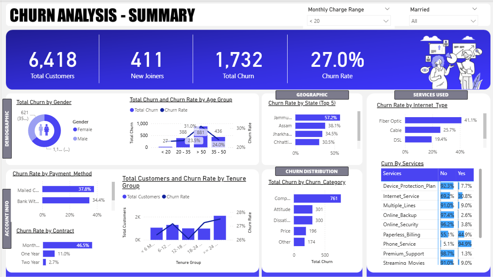
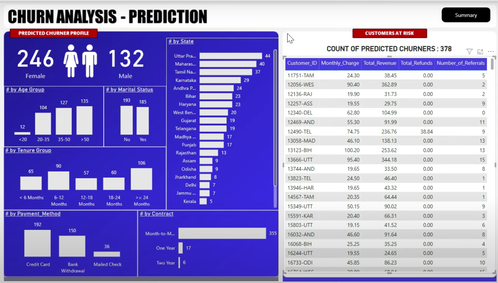

# 📊 Telecom Customer Churn Prediction – BI Dashboard


## 📌 Project Overview
Customer churn is one of the biggest challenges for subscription-based businesses. This project performs **end-to-end churn analysis** for a telecom company using **SQL Server, Power BI, and Machine Learning (Random Forest)** to predict customer churn and provide actionable insights.

The solution includes:
- **ETL Process in SQL Server** to clean & transform data
- **Interactive Power BI Dashboard** for business analysis
- **Random Forest Model** to predict potential churners

---

## 🎯 Project Goals
- Analyze customer demographics, services, account details, and geographic trends
- Identify churn patterns & reasons
- Predict customers likely to churn
- Support marketing campaigns with data-driven insights

---

## 🛠 Tech Stack
- **Database:** Microsoft SQL Server
- **Data Visualization:** Power BI
- **Machine Learning:** Python (Random Forest, Scikit-learn)
- **ETL Tools:** SQL Server Management Studio (SSMS), Power Query
- **Languages:** SQL, Python
- **Other:** Pandas, NumPy, Matplotlib, Seaborn, Joblib

---

## 📂 Folder Structure
```
├── Dashboards          # Power BI dashboard screenshots
├── Dataset             # Source datasets
├── Scripts             # Python scripts for ML model
├── LICENSE
└── README.md
```

---

## 📊 Dashboard Preview

<p align="center">
  
</p>

### **3. Churn Prediction Page**
<p align="center">
  

---

## 🔄 Project Workflow

### **STEP 1 – ETL Process in SQL Server**
1. Load customer dataset into **staging table**
2. Data cleaning: null handling, datatype corrections
3. Move cleaned data to production table
4. Create SQL views for Power BI

### **STEP 2 – Power BI Transformation**
- Created custom calculated columns:
  - `Churn Status`
  - `Monthly Charge Range`
  - Age & Tenure Group mapping
- Unpivoted service columns for better analysis

### **STEP 3 – Power BI Measures**
Key measures:
```DAX
Total Customers = COUNT(prod_Churn[Customer_ID])
Total Churn = SUM(prod_Churn[Churn Status])
Churn Rate = [Total Churn] / [Total Customers]
```

### **STEP 4 – Visualization**
- KPIs for Total Customers, New Joiners, Churn Rate
- Churn distribution by demographic, account info, and geography
- Top churn categories with drill-through to reasons

### **STEP 5 – Predictive Modeling (Random Forest)**
- Preprocessed data with Label Encoding
- Trained Random Forest Classifier
- Saved model & used it to predict churners from "Joiners" dataset
- Exported predictions for visualization in Power BI

---

## 📈 Key Insights
- **Highest churn rate** observed in customers with month-to-month contracts
- **Long tenure customers** are less likely to churn
- **Electronic check payment** method has higher churn percentage
- States with low customer base show more churn volatility

---

## 🚀 How to Run the Project
1. Clone the repository:
```bash
git clone https://github.com/Navyam-04/Telecom_Customer_Churn_Prediction-BI-Dashboard.git
```
2. Set up SQL Server and import dataset using **Import Wizard**
3. Create views as per SQL scripts in `/Scripts`
4. Open Power BI file and connect to your SQL Server instance
5. Run Python script to generate churn predictions and import results into Power BI

---

## 📜 License
This project is licensed under the [MIT License](LICENSE).

---
## 🔗 Connect with Me  
👋 Hi, I'm **Mangali Navya**

[](https://www.linkedin.com/in/navya-mangali/)  
[](mailto:middenavya51@gmail.com)  
[](https://github.com/Navyam-04)  
[](https://mangalinavya.my.canva.site)


_"Learn deeply. Build boldly. Share generously."-Navya
